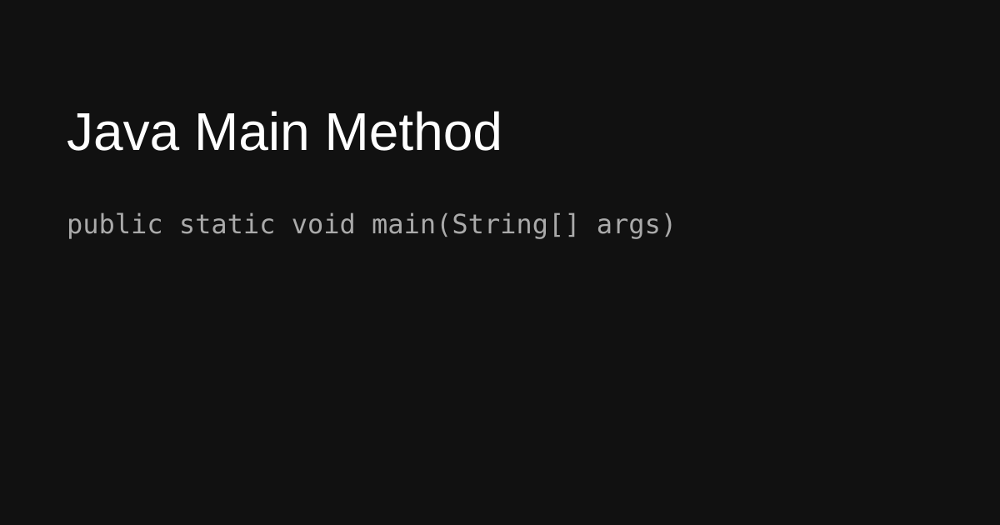
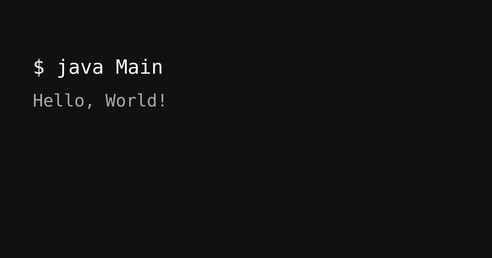

# Java Main Method

The `main` method is the entry point of a Java application.



```java
public class Main {

    public static void main(String[] args) {
        System.out.println("Hello, World!");
    }
}
```


